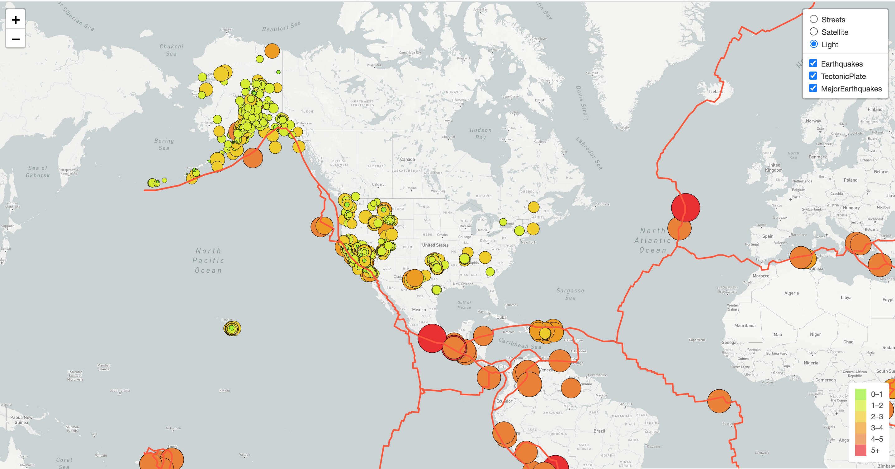
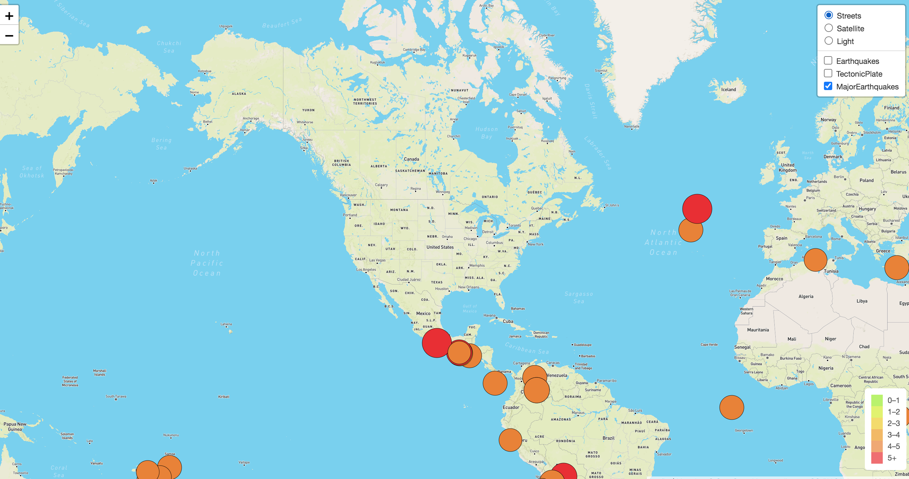
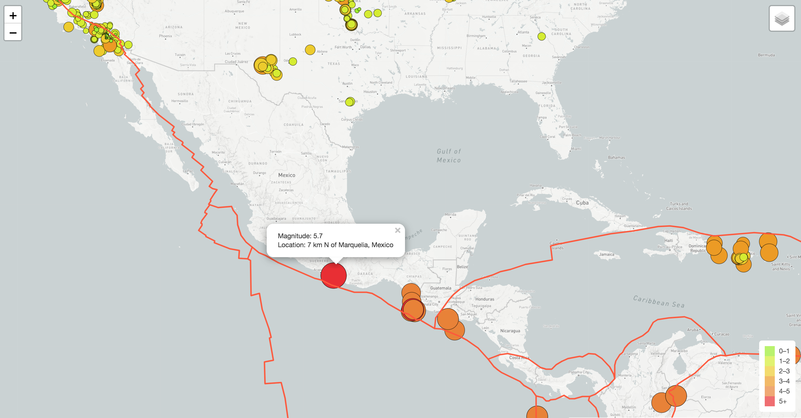

# Mapping_Earthquakes
## Purpose
### Summary
The purpose of this project is to visually show the differences between the magnitudes of earthquakes all over the world for the last seven days. Readers can click on each circle to get information about the *Magnitude* and the *Location* of the earthquake.
### Tools
The following list of tools and libraries are used to accomplish the final result of this project - graphs are included in the Demonstration section below. 
* Github - branches creating and merging are used to keep track of the change of code
* JavaScript ES6 - functions used to add GeoJSON data, features, and interactivity to maps
* JSON D3 - D3 libraries are used to populate geographical maps with GeoJSON data
* Leaflet & Mapbox - Leaflet library is used together with Mapbox API calls to create geographical maps that allow users to control and interact with the data
## Demonstration
The map created has three base tile layers: Streets, Satellite, and Light. Each layer has it's own unique featured background. The data display can be toggled by checking/unchecking boxes besides Earthquakes, TectonicPlate, and MajorEarthquakes to show the desired result on the map.

*Note: The bigger the circle's diameter is, the stronger the magnitude of the earthquake is.*

Example 1:

Light background base layer map, with two earthquackes data sets and tectonic plate display:

Example 2:

Satellite background base layer map, with MajorEarthquakes data and the tectonic plate display:

Example 3:

Streets background base layer map, with only MajorEarthquakes data displayed:

Example 4:

Popup information on the Magnitude and Location when click on the circle

